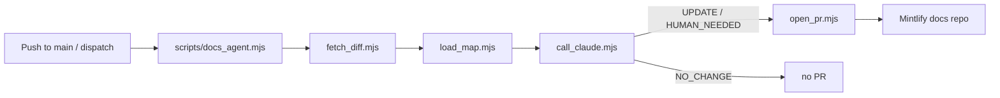

# Docs Agent

The docs agent watches merged commits on this repository and opens documentation pull requests in a separate Mintlify docs repository. It reads the unified diff for the merged commit, asks Claude per affected docs file whether the file should change, and either opens an `UPDATE` pull request with the patched content or a `HUMAN_NEEDED` pull request with reasoning when it cannot decide safely.

## Flow



## Repository Layout

| Path | Purpose |
| --- | --- |
| [.github/workflows/agent.yml](../.github/workflows/agent.yml) | Workflow definition. Triggers on `push` to `main` and `workflow_dispatch`. |
| [docs-map.yml](../docs-map.yml) | Source-glob to docs-file mapping. The agent only considers docs files whose globs match changed source paths. |
| [scripts/docs_agent.mjs](docs_agent.mjs) | Orchestrator and entry point. Emits structured JSON logs. |
| [scripts/fetch_diff.mjs](fetch_diff.mjs) | Fetches the unified diff and changed-file list for a commit via the GitHub API. |
| [scripts/load_map.mjs](load_map.mjs) | Loads `docs-map.yml`, performs glob matching, returns deduped docs candidates. |
| [scripts/call_claude.mjs](call_claude.mjs) | Calls the Anthropic Messages API and validates the strict JSON response. |
| [scripts/open_pr.mjs](open_pr.mjs) | Creates a branch in the docs repo, writes content or a follow-up note, pushes, and opens or updates a labeled PR via `gh`. |

## Triggers

- `workflow_dispatch` accepts three optional inputs: `commit_sha`, `source_repo`, `docs_repo`. Use it for the demo or to re-process a specific commit.
- `push` on `main` runs the agent against `github.sha`. There is intentionally no `paths` filter; the agent itself is the gate via `docs-map.yml`. Add a `paths` filter later if Anthropic spend becomes a concern.

## Required Configuration

### Repository secrets

| Secret | Required | Notes |
| --- | --- | --- |
| `ANTHROPIC_API_KEY` | Yes | Used to call the Anthropic Messages API. |
| `DOCS_REPO_TOKEN` | One of two options | Personal access token (or fine-grained token) with `contents:write` and `pull_requests:write` on the docs repo. |
| `DOCS_APP_ID` and `DOCS_APP_PRIVATE_KEY` | One of two options | GitHub App credentials. The workflow mints a short-lived installation token at runtime. The App must be installed on the docs repo with `contents:write` and `pull_requests:write`. |

If both `DOCS_REPO_TOKEN` and the GitHub App pair are configured, the PAT wins. The workflow exposes both through the `DOCS_REPO_TOKEN` GitHub Actions environment, so secrets are scoped to runs that explicitly target it.

### Repository variables

| Variable | Default | Notes |
| --- | --- | --- |
| `DOCS_REPOSITORY` | `soheimam/nodes-docs` | Default docs repository in `owner/name` form. Overridable per-run via the `docs_repo` workflow input. |
| `DOCS_LLM_MODEL` or `ANTHROPIC_MODEL` | `claude-sonnet-4-5` | Anthropic model. |

## docs-map.yml

The map is a flat YAML object whose keys are globs matched against changed source paths and whose values are docs files (relative to the docs repository root) that may need updates.

```yaml
"geth/**":
  - "node-operators/geth.mdx"
"versions.env":
  - "node-operators/versions.mdx"
```

Glob support:

- `*` matches one path segment (no `/`).
- `**` matches any depth, including zero segments.
- Exact paths match literally.

Add an entry whenever a new docs page should track a source area. Validate locally with the smoke test below.

## Behavior Per Docs File

For each docs file matched by the map, the agent calls Claude with the diff and the current docs content and expects strict JSON of the form:

```json
{
  "decision": "UPDATE | NO_CHANGE | HUMAN_NEEDED",
  "reasoning": "1 to 3 sentences",
  "patched_content": "Full new file content (only for UPDATE)"
}
```

| Decision | Action |
| --- | --- |
| `UPDATE` | Branch `docs-agent/<short-sha>/<slug>` is created, the docs file is overwritten with `patched_content`, the change is committed, pushed with `--force-with-lease`, and a PR is opened in the docs repo. |
| `HUMAN_NEEDED` | A placeholder note is written to `agent-followups/<short-sha>-<slug>.md` in the docs repo so the PR has a non-empty diff. The PR body explains why human review is needed. |
| `NO_CHANGE` | No PR is opened. |

Every PR is labeled `docs-agent` (the workflow attempts to add the label; PRs still open if the label cannot be applied). One PR is opened per affected docs file, which keeps reviews small and focused.

## Safety Guardrails

- The Claude response is rejected when `decision` is unknown, when `patched_content` matches a secret-like regex, or when `UPDATE` arrives without `patched_content`.
- Generated changes targeting `.env*`, `.github/workflows/*`, `*.pem`, `*.key`, or `node_modules/*` are refused before any commit.
- All logs are structured JSON with `timestamp`, `level`, and low-cardinality fields. Tokens, full diffs, and Claude payloads are never logged.
- The workflow runs under `permissions: contents: read` for the source checkout and uses the docs-repo token only for the docs checkout and PR steps.

## Local Smoke Test

Install `js-yaml` to a runner-style cache so the scripts resolve it the same way the workflow does:

```bash
mkdir -p /tmp/agent-deps
npm install --prefix /tmp/agent-deps --no-save --no-audit --no-fund js-yaml@4.1.0
```

Verify glob matching against the real `docs-map.yml`:

```bash
NODE_PATH=/tmp/agent-deps/node_modules node -e '
import("./scripts/load_map.mjs").then(({ loadDocsMap, findAffectedDocs }) => {
  const map = loadDocsMap("./docs-map.yml");
  const matches = findAffectedDocs({
    docsMap: map,
    changedFiles: ["geth/Dockerfile", "versions.env"],
  });
  console.log(JSON.stringify(matches, null, 2));
});
'
```

Exercise `open_pr.mjs` without any network calls:

```bash
node -e '
import("./scripts/open_pr.mjs").then(({ openDocsPullRequest }) => {
  const result = openDocsPullRequest({
    docsRepoRoot: "/tmp/docs-repo",
    docsRepo: "owner/nodes-docs",
    docsRepoToken: "fake",
    decision: "UPDATE",
    docsPath: "node-operators/geth.mdx",
    patchedContent: "# Geth\n\nUpdated.\n",
    reasoning: "Source pinned a new version.",
    commit: {
      sourceRepo: "owner/node",
      shortSha: "abc123def456",
      commitTitle: "Update geth",
      commitUrl: "https://github.com/owner/node/commit/abc123",
    },
    affectedSources: ["geth/Dockerfile"],
    dryRun: true,
  });
  console.log(JSON.stringify(result, null, 2));
});
'
```

Run the orchestrator end-to-end against a real commit. This calls Anthropic and pushes branches to the docs repo, so use a scratch docs repo when testing:

```bash
COMMIT_SHA=<sha> \
SOURCE_REPO=<owner/node> \
DOCS_REPO=<owner/nodes-docs> \
ANTHROPIC_API_KEY=<key> \
GITHUB_TOKEN=<source-read-token> \
DOCS_REPO_TOKEN=<docs-write-token> \
NODE_PATH=/tmp/agent-deps/node_modules \
node scripts/docs_agent.mjs --docs-repo-root <local-docs-checkout>
```

## Operational Notes

- The diff is capped at 200 KB by default; override with `DOCS_AGENT_MAX_DIFF_BYTES` if a single commit ever exceeds this and the truncation marker is unhelpful.
- Each docs file's existing content is capped at 80 KB before being sent to Claude; override with `DOCS_AGENT_MAX_DOC_BYTES`.
- Branch names are deterministic on `<short-sha>/<slug>`, so re-running the workflow against the same commit updates the existing PR rather than opening a duplicate.

## Troubleshooting

| Symptom | Likely cause |
| --- | --- |
| `Configure either DOCS_REPO_TOKEN or DOCS_APP_ID and DOCS_APP_PRIVATE_KEY` | Neither auth path is configured for the `DOCS_REPO_TOKEN` environment. |
| `Anthropic request failed with 401` | `ANTHROPIC_API_KEY` is missing, expired, or scoped to the wrong workspace. |
| `Refusing to write generated change to protected path` | A docs entry resolved to `.env*` or another protected path. Update `docs-map.yml`. |
| `Claude response for <file> had invalid decision` | Model returned text instead of JSON. Re-run; if it persists, lower temperature is already set, so consider switching `ANTHROPIC_MODEL`. |
| Workflow runs but no PR appears | `findAffectedDocs` found no matches. Check the structured log for `No docs files matched changed source paths` and update `docs-map.yml`. |
